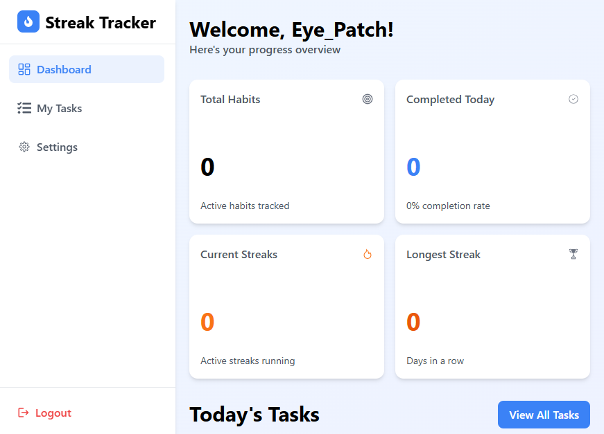
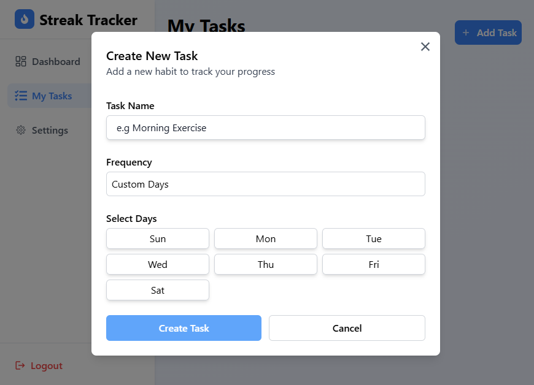
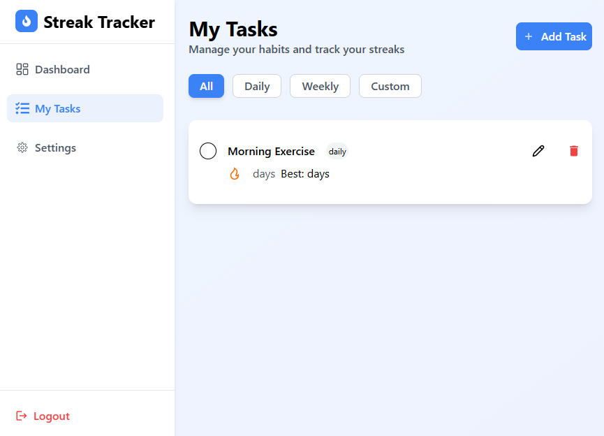

 

A modern web application for tracking habits and building streaks. Users can create daily, weekly, or custom-frequency habits, monitor progress on a clean dashboard, and stay motivated with streak counters and completion stats.

**Live Demo:** [streaktracker-eyepatch.netlify.app]  
**Note:** Includes user authentication (login/register) – screenshots focus on core features.

## Features

- **Personalized Dashboard**: Overview of total habits, daily completions, current streaks, and longest streaks.
- **Habit Management**: Add, edit, delete habits with flexible frequency (daily, weekly, custom days).
- **Progress Tracking**: Visual metrics and streak motivation (e.g., "Best: X days").
- **User Authentication**: Secure login and registration for personalized data.
- **Settings**: Update profile (name, email, password), toggle notifications (email reminders, streak alerts, daily summaries), and switch to dark mode.
- **Responsive Design**: Clean, intuitive UI optimized for desktop and mobile.
- **Backend Integration**: Full API for data storage, user sessions, and habit persistence.

## Tech Stack

- **Frontend**: React.js – with responsive layout and modal components.
- **Backend**: Node.js + Express (or your choice).
- **Database**: MongoDB / PostgreSQL (for user data and habits).
- **Authentication**: JWT / Sessions (secure login/register).
- **Other**: API integration for CRUD operations, state management.

  
*Showcases a UI that allows users to login into their dashboard*

  
*Showcases a UI that allows users to register their profile into the system*

  
*Create Habits with flexible frequency*

  
*Showcases Habits created by user*

  
*Showcases Ui that allows users to activate available features e.g switching to darkMode*

## Installation & Setup

1. Clone Repo
```bash
git clone https://github.com/TaslimYusuf2210/Streak-Tracker.git
cd streak-tracker

2. Install Dependencies
npm install

3. Run Development Server
npm run dev